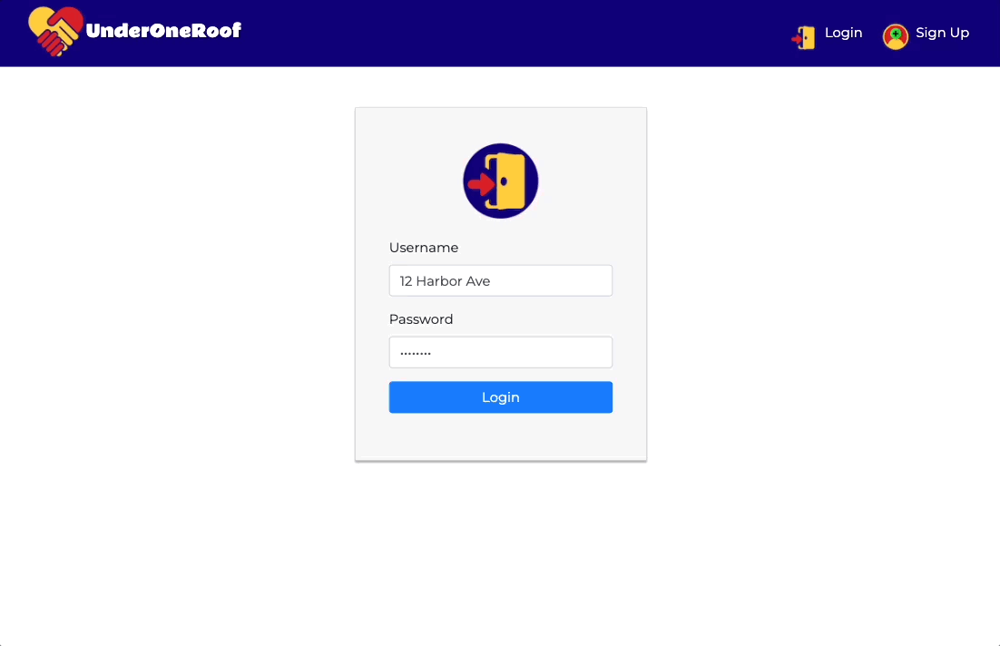

# UNDER ONE ROOF

---

## PROJECT SUMMARY
A household management tool for roommates to delegate chores, manage a household budget and track shared expenses, notify each other of relevant events, and look up emergency contact info.
Built using Node.js, Express.js, React.js, MySQL/Sequelize, Bootstrap for styling, JWT authentication and app-wide state management via Redux. Deployed on Heroku and Netlify.

## TECHNOLOGIES & LIBRARIES USED
- [HTML](https://developer.mozilla.org/en-US/docs/Web/HTML)
- [CSS](https://developer.mozilla.org/en-US/docs/Web/CSS)
- [Bootstrap](https://getbootstrap.com/)
- [JavaScript](https://www.javascript.com/)
- [jQuery](https://jquery.com/)
- [JSON](https://www.json.org/json-en.html)
- [MySQL](https://www.mysql.com/)
- [Sequelize](https://sequelize.org/)
- [Express.js](https://expressjs.com/)
- [React](https://reactjs.org/)
- [Node.js](https://nodejs.org/en/)
- [bcryptjs](https://www.npmjs.com/package/bcryptjs)
- [react-calendar](https://www.npmjs.com/package/react-calendar)
- [react-dayjs](https://www.npmjs.com/package/react-dayjs)
- [react-dom](https://reactjs.org/docs/react-dom.html)
- [react-router-dom](https://reactrouter.com/web/guides/quick-start)
- [react-scripts](https://www.npmjs.com/package/react-scripts)
- [react-table](https://www.npmjs.com/package/react-table)
- [react-validation](https://www.npmjs.com/package/react-validation)
- [react-vis](https://uber.github.io/react-vis/)
- [JWT](https://jwt.io/)
- [Day.js](https://day.js.org/)
- [mysql2](https://www.npmjs.com/package/mysql2)
- [Visual Studio Code](https://code.visualstudio.com/)

## AUTHORS
- **Jordan Kelly** -- [GitHub](https://github.com/profjjk) | [LinkedIn](https://www.linkedin.com/in/the-real-jordan-kelly/)
- **Ryan Kirkland** -- [GitHub](https://github.com/RyanKirkland86) | [LinkedIn](https://www.linkedin.com/in/ryan-kirkland-619942200/)
- **Shaun Limbeek** -- [GitHub](https://github.com/slimbeek6) | [LinkedIn](https://www.linkedin.com/in/shaun-limbeek/)

## ACKNOWLEDGEMENTS
A special thanks to our [UC Berkeley](https://bootcamp.berkeley.edu/coding/) instructors Jerome, Mahi, and Manuel for all of your help and support. You guys are the best!